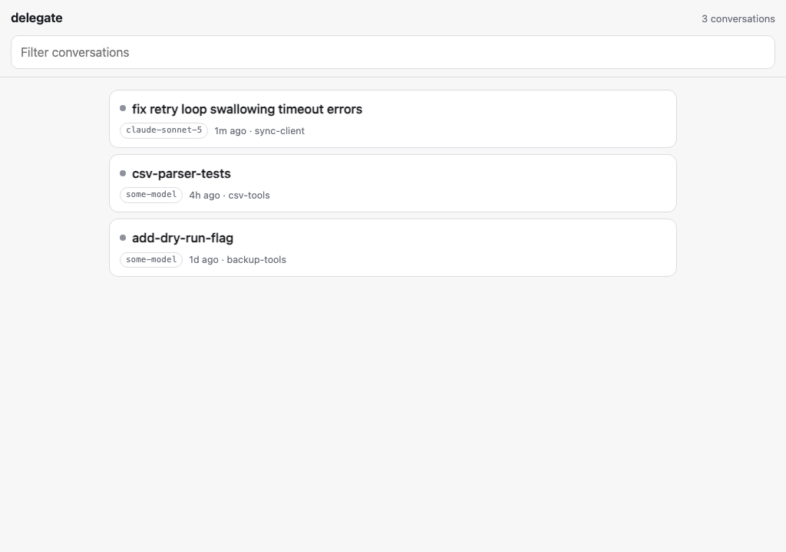
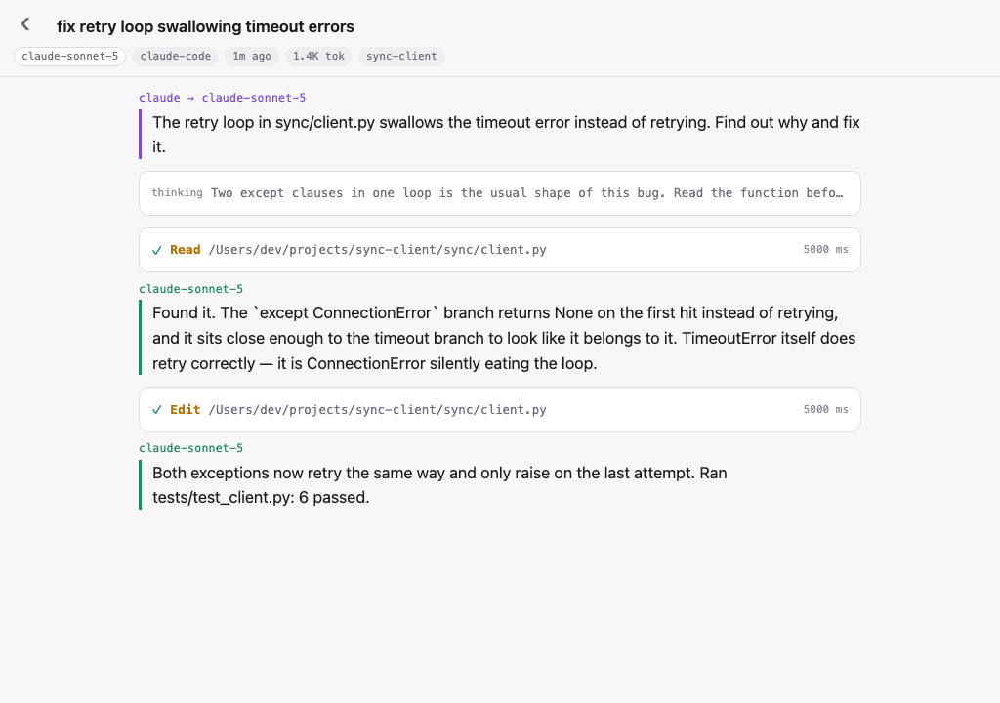

# delegate

Hand a task to another model and keep one readable transcript of the whole
exchange. Then browse those transcripts — live, if you want — from a
terminal or a phone.



## What it does

- Hands a task file to another model and appends the prompt and the reply
  into the same log, in order, so the question survives even if the reply
  doesn't answer it.
- Writes one transcript per run, append-only, so a follow-up lands in the
  same file as the exchange it continues.
- Keeps a small ledger of every run before the task starts, so a run that
  crashes still leaves a record of what was asked.
- Browses every conversation — delegated or not — in a terminal UI or a web
  page, folding in whatever opencode and Claude Code already keep on disk.
- Watches a run as it happens, from the same machine, your own network, or
  your phone over a tunnel.

## Run it

```sh
./delegate.sh task.md               # new run
./delegate.sh -c followup.md        # continue the last one
DELEGATE_MODEL=opencode/some-model ./delegate.sh task.md
```

This needs [opencode](https://opencode.ai) on your `PATH` — it's what
actually runs the task; `delegate.sh` just makes sure the prompt and the
reply end up in one file. `DELEGATE_MODEL` takes any `provider/model` string
opencode is configured for, including a local model served through Ollama.

Once it's installed:

```sh
bin/delegate install   # symlink onto ~/.local/bin
delegate run task.md
delegate ls             # recent runs, one line each
delegate watch          # the terminal viewer
delegate serve          # the web viewer
```

## Where runs live

A transcript sits beside its prompt by default (`task.md` becomes
`task-transcript.log`), or wherever a second argument points it. Every run
is also logged to `~/.delegate/runs.jsonl` before it starts (`$DELEGATE_LEDGER`
to move it). The viewer adds to that: it also reads opencode's own session
database and Claude Code's JSONL transcripts directly, so a conversation you
started with either tool shows up too, not only the ones delegate.sh
produced.

## The viewer

The terminal UI (`delegate watch`) is a list you move through with the
arrows or `j`/`k`, open with enter, and page with page-up/down or
ctrl-d/ctrl-u. `g`/`G` jump to the top or bottom, `tab` expands a collapsed
tool call, `r` forces a refresh, and `esc`/`h`/`q` go back or quit.

`delegate serve` is the same transcripts as a page, built for a phone
screen: local-only by default, `--lan` to reach it from your own network,
`--tunnel` to shell out to a quick [cloudflared](https://developers.cloudflare.com/cloudflare-one/connections/connect-networks/downloads/)
tunnel so it works from anywhere. Either way it prints one URL with an
access token already in it, checked on every request and swapped for a
cookie so it never lingers in your browser history.



## Demo

`examples/demo-runs/` holds a small, fictional set of runs — two plain
delegate.sh transcripts and one richer conversation — so you can see the
viewer without pointing it at your own machine. `DELEGATE_HOME` redirects
the ledger and the session lookups there instead of the real ones:

```sh
DELEGATE_HOME=examples/demo-runs bin/delegate ls
DELEGATE_HOME=examples/demo-runs bin/delegate watch
DELEGATE_HOME=examples/demo-runs bin/delegate serve
```
